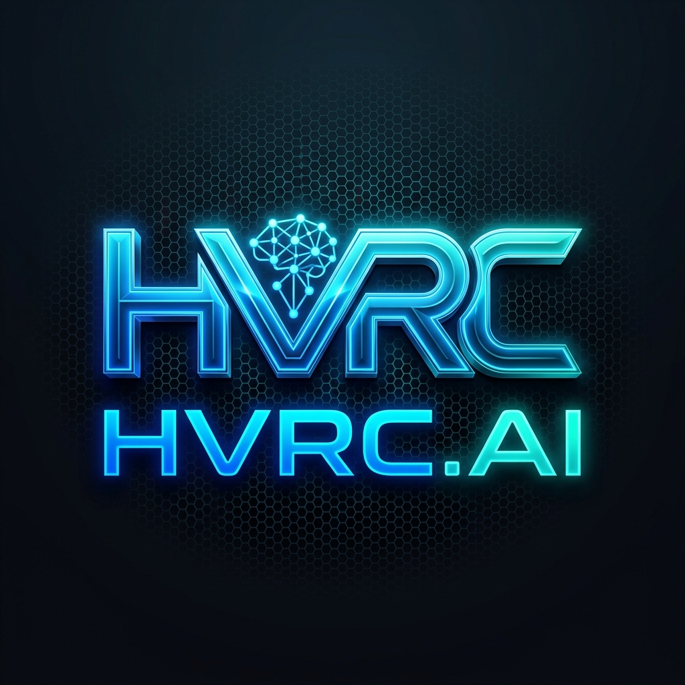

# HVRC.AI — Next-Gen AI Operating System & Web Workspace

<p align="center">
  
</p>

<p align="center">
  <b>HVRC.AI</b> is a world-class browser-first AI operating platform combining interactive code generation, live web application previews, zero-server model routing, and vector knowledge bases.
</p>

<p align="center">
  <a href="https://github.com/concepttoclaritylearning/hvrc-ai-platform/blob/main/LICENSE"></a>
  <a href="https://github.com/concepttoclaritylearning/hvrc-ai-platform"></a>
  <a href="https://github.com/concepttoclaritylearning/hvrc-ai-platform"></a>
</p>

---

## ⚡ Key Platform Features

- 💻 **Browser-First IDE & Live Sandbox**: Edit React/Tailwind code with real-time Hot Module Replacement (HMR) iframe preview.
- 🟢 **Stateless NVIDIA NIM Proxy Backend**: High-performance Express proxy server running on `http://localhost:3001` handling `/proxy/nvidia/models` and `/proxy/nvidia/chat`.
- 🌐 **Dynamic BYOK Model Hub**: Network-based model discovery for NVIDIA NIM, OpenRouter, and Groq with live API key verification.
- 🎨 **Star Model Pinning**: Favorite model selection system ensuring only user-selected models appear in the top navigation bar.
- 📚 **Vector RAG Knowledge Base**: Upload real local files (PDF, Markdown, TXT, CSV) and ingest web URLs.
- ⚡ **Prompt Engineering Library**: Store, copy, create, and delete custom prompt templates.
- 📜 **Audit History & Logs**: Complete activity history with custom filters and log deletion options.

---

## 🏗️ Architecture & Component Layout

```text
hvrc-ai-platform/
├── backend/
│   ├── package.json
│   └── src/
│       ├── server.js               # Express Proxy Server (Port 3001)
│       ├── controllers/            # Model discovery, chat completion & health
│       ├── middleware/             # Rate limiting, validation & error handlers
│       ├── routes/                 # Endpoint routes (/proxy/nvidia/*)
│       └── services/               # NVIDIA NIM API integration & SSE streaming
└── frontend/
    ├── package.json
    ├── vite.config.js              # Vite HMR dev server & proxy routes
    └── src/
        ├── ModelContext.jsx        # Site-wide BYOK state & model pinning
        ├── components/
        │   ├── Navbar/            # Top navigation & favorite model dropdown
        │   └── Sidebar/           # Navigation sidebar
        └── pages/
            ├── DashboardPage/      # Command center
            ├── ProjectWorkspace/   # Code editor & live web preview
            ├── ProjectChat/        # AI Code Assistant & thread management
            ├── ModelHubPage/       # Dynamic model catalog & star pinning
            ├── KnowledgePage/      # System file upload & vector RAG
            ├── PromptsPage/        # Custom prompt library
            └── HistoryPage/        # Activity audit logs
```

---

## 🚀 Quick Start Guide

### 1. Prerequisites
- **Node.js**: v18.0.0 or higher
- **npm**: v9.0.0 or higher

### 2. Start the Express Proxy Server (Port 3001)
```bash
cd backend
npm install
npm start
```
*Proxy endpoints enabled:*
- `POST http://localhost:3001/proxy/nvidia/models`
- `POST http://localhost:3001/proxy/nvidia/chat`
- `GET  http://localhost:3001/proxy/nvidia/health`

### 3. Start the Frontend React App (Port 5173)
```bash
cd frontend
npm install
npm run dev
```
Open **`http://localhost:5173`** in your browser.

---

## 🔒 Security & Privacy Guarantees

- **Stateless Proxying**: The backend server does NOT store API keys, user prompts, completions, or database credentials.
- **Header Secret Sanitization**: Logs output timestamp, status code, and latency duration without recording sensitive headers or keys.
- **Zero Raw Error Leaks**: Provider HTTP errors are mapped into clean unified JSON status responses.

---

## 📄 License
This project is licensed under the [MIT License](LICENSE).
